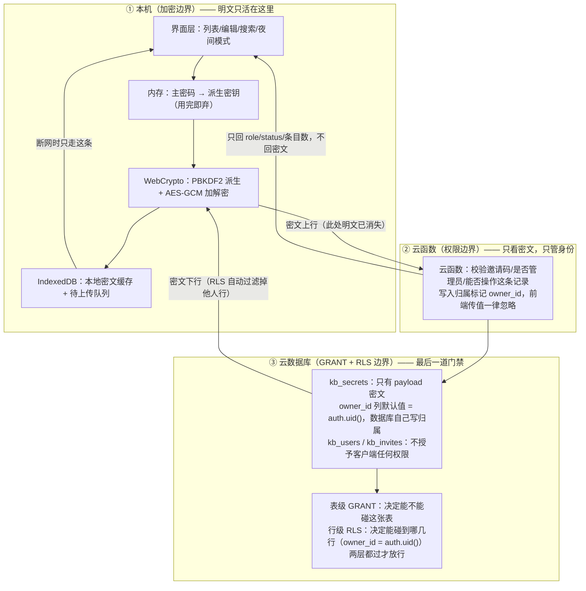
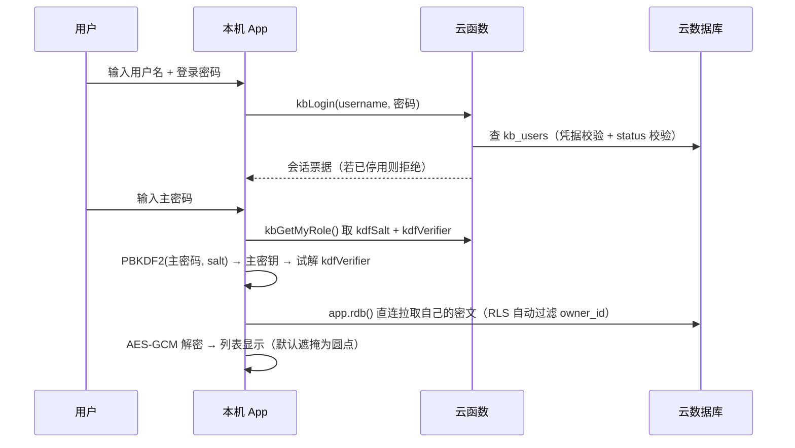

# KeyBox 系统设计与任务分解（ARCHITECTURE）

> 读者：零代码基础的项目所有者 + 后续工程师。术语沿用 `docs/PRD.md` 第 0 节速查表。
> 本文所有 CloudBase（腾讯云开发）相关 API 均已查官方文档/知识库核实；核实不到的已列入第 12 节"待核实清单"，**未凭印象编造 API**。
> 标注约定：**【已核实】**= 有官方文档出处；**【已核实 + 实测】/【实测】**= 已在本环境（`envId=<YOUR_ENV_ID>`）实际探测确认，**不再列为待核实**；**【待核实】**= 见第 12 节。
>
> **⚠️ 本环境已实测为 PG（PostgreSQL）模式，全文按 PG 重写**：`queryEnv(action="info", envId="<YOUR_ENV_ID>")` 返回 `RuntimeMode="postgresql"`、`RuntimeBackends={postgresql:true, nosql:false, mysql:false}`（由团队负责人实测，第 12 节第 1 项已关闭）。因此**不使用**文档型数据库（NoSQL）与集合安全规则，改用 **PG 表 + 表级 GRANT + 行级 RLS Policy**。PG 模式仅新建环境支持，存量环境不能升级。
>
> **⚠️⚠️ 架构变更（2026-09-29）：登录方式由「用户名密码 + 自定义登录票据」改为「手机号验证码登录」**
> **原因**：本环境实测自定义登录不可用——云函数 `auth().createTicket()` 签出的票据，服务端恒返回
> `私钥已过期或私钥不存在，请重新生成`（`invalid_argument` / code 3）；官方 `CreateCustomLoginKeys`
> 重新签发的密钥同样未被平台登记，而该配置只能由控制台生成。改用平台原生手机号验证码登录后**零密钥依赖**。
>
> **变更要点（本文档其余章节凡与此冲突，以本节为准）**：
> - **登录**：`auth.signInWithOtp({ phone })` + `data.verifyOtp({ token })`，封装在 `src/lib/phone-auth.ts`
> - **身份**：`uid` = **平台账号 uid**（不再由云函数生成 24 位 uid）；`kb_users.uid` 即平台会话 uid
> - **`kbInitAdmin` / `kbRegister`**：身份取自 `getCaller()`；入参不再含用户名 / 登录密码；
>   `login_hash` 写哨兵值 `RESET-REQUIRED`（该账号不走密码登录）；`kbRegister` 为**幂等**接口
> - **`kbLogin` 已停用**（代码保留但前端不再调用）；自定义登录密钥（`tcb_custom_login.json`）相关配置全部作废
> - **调用通道**：云函数一律在**已登录**状态下经 SDK `callFunction` 调用；HTTP 网关的 `/api/*` 路由已删除
> - **未变**：本地加密模型（主密码 / KDF / AES-GCM）、RLS 列级与行级隔离、邀请码一次性开户、
>   20 人上限、恢复码（R28）四项设计全部保持原样

---

## 1. 一句话结论

前端一套代码跑桌面与安卓，云端 CloudBase 只存密文，钥匙只在你本机。

---

## 2. 技术选型表

| 模块 | 技术名（白话） | 为什么选它 | 开源友好 |
|------|----------------|-----------|----------|
| 前端框架 | Vite + React 18（网页骨架） | 一套代码可同时喂给 Tauri 与 Capacitor；生态成熟、打包快 | 是（MIT） |
| UI | Tailwind CSS + MUI 基础件 | 夜间模式只需切一个 class（代码里的样式标记），成本最低 | 是（MIT） |
| 桌面打包 | Tauri 2（网页变 exe） | 产物小、不内嵌浏览器内核，比 Electron 轻 10 倍 | 是（MIT/Apache-2.0） |
| 安卓打包 | Capacitor（网页变 apk）+ GitHub Actions（自动流水线） | 复用同一套前端产物；apk 在云端构建，本机不用装安卓 SDK | 是（MIT） |
| 后端 | CloudBase 云函数 Node.js 18 | 敏感校验必须在服务端；免运维、按量付费 | 平台服务，代码可开源 |
| 数据库 | CloudBase **PostgreSQL**（本环境实测 `postgresql:true, nosql:false`） | PG 提供**表级 GRANT + 行级 RLS** 双层门禁，改前端也穿不过；且归属可由列默认值 `DEFAULT auth.uid()` 写入 | 平台服务 |
| 客户端数据访问 | `app.rdb()`（SDK v3 的 PG 接口） | PG 模式下**必须**用它；NoSQL 的 `app.database()` 在本环境不可依赖 | 平台 SDK |
| 归属与门禁 | 列默认值 `owner_id DEFAULT auth.uid()` + RLS Policy | 归属由**数据库自己**写入，比"云函数写"更靠前一层（R08） | SQL，可随迁移脚本开源 |
| 账号登录 | **CloudBase Auth 手机号验证码登录**（2026-09-29 变更；原方案为自定义登录票据） | 原"用户名密码 + 由云函数签发自定义票据"在本环境**实测不可用**（服务端恒拒自签票据，且密钥只能由控制台生成）；手机号验证码是平台原生能力，**零密钥依赖**、开箱可用 | 平台服务 |
| 本机加密 | WebCrypto（浏览器自带加密库） | 平台标准库，硬约束 3 要求禁止自研算法 | 浏览器内置 |
| 本机存储 | IndexedDB（浏览器自带小数据库） | 桌面/安卓/浏览器三端同一套 API，断网可读 | 浏览器内置 |
| 许可证 | MIT，持有人「机动战士」 | 全量开源含打包配置与 CI | 是 |

---

## 3. 系统分层图（三道边界）



**明文在哪一层消失**：明文（站点名、网址、密钥、备注、标签、主密码）**从未离开第 ① 层**。第 ① 层与第 ② 层之间传输的只有 AES-GCM 密文串。第 ②、③ 层以及抓包、数据库后台、管理员账号里，**永远只有乱码**。
因为：只要明文跨过第 ① 层一次，"云端只见密文"的承诺就整体作废，所以边界画在"出本机之前"而不是"进数据库之前"。

---

## 4. 数据表设计（三张表）

> **命名**：PG 表一律 **snake_case** 物理列名（官方建议），前端 camelCase 在服务层显式映射。
> **时间**：一律 `timestamptz`（带时区的时间戳），不用毫秒数字，因为 PG 下可直接用 `now()` 与 SQL 比较。
> **⚠️ 归属列一律 `text`，全表无 `uuid` 类型**（已核实 + 实测）：`auth.uid()` 返回的是 **text**（形如 `EchhGXFadSANiCSaVim2wQ`），官方模板即 `owner_id TEXT NOT NULL DEFAULT auth.uid()`。声明成 `uuid` 会在建表/查询时报 `operator does not exist: uuid = text`。**此点与 Supabase 不同**（Supabase 返回 uuid），全文按 text 口径。

### 4.1 `kb_users`（用户资料）

| 字段名 | 类型 | 含义 | 是否密文 | 谁可读写 |
|--------|------|------|----------|----------|
| `uid` | text PK | CloudBase 用户唯一 ID，**归属判定的主键** | 否 | 云函数 |
| `username` | text UNIQUE | 登录用户名 | 否（与"是谁"绑定，无法加密） | 云函数 |
| `login_hash` | text | 登录密码的 scrypt 哈希（带盐），云端**永不存明文密码** | 否（是哈希不是明文） | 云函数 |
| `role` | text | `admin` / `user` | 否 | 云函数 |
| `status` | text | `active` / `disabled` / `deleted` | 否 | 云函数 |
| `kdf_salt` | text | 主密码派生用的随机盐（base64，16 字节） | 否（盐本就可公开） | 云函数 |
| `kdf_salt_prev` | text | 上一代盐，仅用于改主密码失败回滚 | 否 | 云函数 |
| `kdf_verifier` | text | 用主密钥加密固定串得到的密文，只用来判断"主密码输对了没" | **是** | 云函数 |
| `key_epoch` | integer | 密钥代数，改主密码 +1；用于识别"半新半旧" | 否 | 云函数 |
| `created_at` | timestamptz | 注册时间 | 否 | 云函数 |

> **✅ 已落地（迁移 `20260928034647_recovery_code_columns`，team-lead 已实库验证）**：R28 恢复码所需的 4 列已进库——列存在、**四列全部可空**（迁移注释三条理由：存量行 NOT NULL 会使 ALTER 直接失败、ack 语义本就是 NULL、恢复码是可后补项不阻断开户）、**`recovery_*` 对 `anon`/`authenticated` 零授权**（`information_schema.column_privileges` 实查 0 行；客户端永远读不到，读写一律经云函数 `service_role`）。
> **列名更正**：第 4 列经 team-lead 裁决定为 **`recovery_ack_at`**（**不用**本文早先占位的 `recovery_used_at`）；语义＝用户勾选"我已抄下并自行保管"的时间，**为 NULL ⇒ 前端持续提醒**（持久提醒据此判定，无需额外布尔列）。

| 字段名 | 类型 | 含义 | 是否密文 | 谁可读写 | 状态 |
|--------|------|------|----------|----------|------|
| `recovery_salt` | text | 恢复密钥派生盐（base64，16B 随机），**必须独立于 `kdf_salt`**（`wrapMasterKeyWithRecovery` 入口强校验拒绝两者相等，见 §6.4） | 否（盐本就可公开） | 云函数（service_role） | **✅ 已落地（迁移 20260928034647）** |
| `recovery_blob` | text | `KBRC1:` + base64(IV‖AES-GCM(RK, 主密钥))，遗忘主密码时用恢复码解开主密钥；不含恢复码/主密钥明文 | **是** | 云函数（service_role） | **✅ 已落地（迁移 20260928034647）** |
| `recovery_created_at` | timestamptz | 写入恢复材料的时间（NULL＝该账号尚无恢复码，可后补） | 否 | 云函数（service_role） | **✅ 已落地（迁移 20260928034647）** |
| `recovery_ack_at` | timestamptz | 用户勾选"我已抄下并自行保管"的时间；**为 NULL ⇒ 前端持续提醒** | 否 | 云函数 `kbAckRecovery`（仅写本人行单列） | **✅ 已落地（迁移 20260928034647）** |

### 4.2 `kb_secrets`（密钥记录）

| 字段名 | 类型 | 含义 | 是否密文 | 谁可读写 |
|--------|------|------|----------|----------|
| `id` | bigint 自增 PK | 记录主键 | 否 | 本人 |
| `owner_id` | text **DEFAULT auth.uid()** | **归属标记**，由**数据库列默认值**写入 | 否 | 数据库写 / RLS 读 |
| `payload` | text | `KB1:` + base64(IV + 密文 + GCM 标签)，内含站点名/网址/密钥/备注/标签的 JSON | **是（整块）** | 本人读写；管理员**不可读** |
| `key_epoch` | integer | 本条用的是第几代密钥 | 否 | 云函数 |
| `updated_at` | timestamptz | 服务端写入的更新时间，冲突判定用 | 否 | 云函数 |

> **为什么整条 `payload` 打成一块密文**：分字段加密会让云端看出"这条有 4 个字段、密钥大概多长"，属于无谓泄露；整块加密只暴露"这条有多长"。

### 4.3 `kb_invites`（邀请码）

| 字段名 | 类型 | 含义 | 是否密文 | 谁可读写 |
|--------|------|------|----------|----------|
| `id` | bigint 自增 PK | 主键 | 否 | 云函数 |
| `code` | text UNIQUE | 码值，如 `KB-8f2a3c`，云函数内随机生成 | 否 | 云函数 |
| `status` | text | `unused` / `used` / `revoked` | 否 | 云函数 |
| `created_by` | text | 生成者 uid | 否 | 云函数 |
| `created_at` | timestamptz | 生成时间 | 否 | 云函数 |
| `used_by` / `used_at` | text / timestamptz | 被谁、什么时候占用（**并发去重的判据**） | 否 | 云函数 |

### 4.4 归属标记在 PG 下由谁写（比 NoSQL 方案更强）

| 层 | 谁写 `owner_id` | 作用 |
|----|--------------|------|
| **第一层（最靠前）** | **数据库列默认值** `owner_id text NOT NULL DEFAULT auth.uid()` | 客户端 INSERT 时**不传** `owner_id`，数据库自动填入当前登录者；传了也会被 INSERT 策略的 `WITH CHECK` 拒绝。归属在**写库那一刻**就已确定 |
| **第二层** | 云函数显式写入 | 管理员类操作（整批覆盖、删他人数据）走服务端，此时 `auth.uid()` 不适用，由云函数按会话身份显式指定 `owner_id` |

**为什么两层都要**：列默认值挡住"客户端伪造归属"（R08 的第一道，且在数据库层，前端改代码完全无效）；云函数层挡住"服务端批量操作时归属丢失"。
**为什么不再需要 `_openid`**：PG 没有平台自动注入的 `_openid` 字段（那是文档型数据库的机制）；PG 用 `auth.uid()` 直接从登录 JWT 取身份，本身就是权威来源，不需要第二个兜底字段。
**为什么不用外键到 `auth.users`**：登录账号走自定义登录票据，`uid` 由我们签发；是否要外键约束到 `auth.users` 待核实（第 12 节第 15 项），先不加外键以免影响注册流程。

---

## 5. 权限：建表 DDL + RLS 策略 SQL 全文（PG）

> **执行方式（已核实 + 实测）**：建表这类 **DDL 必须走版本化迁移**——本地写 `cloudbase/migrations/<14位UTC时间戳>_<snake_case名>.sql`，再调 `managePgDatabase(action="applyMigration", migrationName=<蛇形名>, migrationVersion=<14位时间戳>, sql=..., confirm=true)`；**迁移版本号必须与文件名一致，不一致会 fail-closed**。直接用 `execute` 跑 DDL 会被软阻断（`DDL_USE_APPLY_MIGRATION`）。`GRANT` / `CREATE POLICY` 可随同一份迁移下发，或用 `execute` 单独执行；**一次只执行一条 SQL**，不要用分号拼多条。
> **⚠️ 已核实的坑**：`CREATE TABLE IF NOT EXISTS` 在表已存在时会**静默跳过**，即使列名是错的。建表前先跑 `SELECT column_name, data_type FROM information_schema.columns WHERE table_name='kb_secrets'` 确认，否则后续所有查询都会因列名不符而失败。
> **⚠️ 已核实**：启用 RLS 但**没有**任何 Policy 时，非管理员角色**读不到任何行**。所以建表后必须先建 Policy 再测前端，否则表现为"保存失败"却无明确报错。
> **✅ 实测（环境现状 + auth 函数）**：当前环境 `envId=<YOUR_ENV_ID>` 只有 `auth` / `storage` / `cloudbase_migrations` 三个 schema，**没有任何业务表**（干净起点）。`auth` schema 下 **`auth.uid()` / `auth.role()` / `auth.jwt()` / `auth.email()` 四个辅助函数均已实测存在**，本文策略谓词可直接使用；`auth.uid()` 返回 **text**。角色实测：`service_role` 存在且 `rolbypassrls = true`，`anon`、`authenticated` 均存在。
> **⚠️ 白送的风险面不要引**：环境里虽有 `storage` schema，但**本项目没有文件上传需求**，因此**不创建 pgstore 桶、不引入 `storage.objects` 的 RLS**——用不到就是纯风险面。

### 5.0 建表 DDL（放在 `cloudbase/migrations/<14位时间戳>_init_keybox.sql`）

```sql
CREATE TABLE public.kb_users (
  uid            text PRIMARY KEY,
  username       text NOT NULL UNIQUE,
  login_hash     text NOT NULL,
  role           text NOT NULL DEFAULT 'user',
  status         text NOT NULL DEFAULT 'active',
  kdf_salt       text NOT NULL,
  kdf_salt_prev  text,
  kdf_verifier   text NOT NULL,
  key_epoch      integer NOT NULL DEFAULT 0,
  created_at     timestamptz NOT NULL DEFAULT now()
);

CREATE TABLE public.kb_secrets (
  id          bigint GENERATED ALWAYS AS IDENTITY PRIMARY KEY,
  owner_id       text NOT NULL DEFAULT auth.uid(),
  payload     text NOT NULL,
  key_epoch   integer NOT NULL DEFAULT 0,
  updated_at  timestamptz NOT NULL DEFAULT now()
);
CREATE INDEX kb_secrets_owner_id_idx ON public.kb_secrets (owner_id);

CREATE TABLE public.kb_invites (
  id          bigint GENERATED ALWAYS AS IDENTITY PRIMARY KEY,
  code        text NOT NULL UNIQUE,
  status      text NOT NULL DEFAULT 'unused',
  created_by  text NOT NULL,
  created_at  timestamptz NOT NULL DEFAULT now(),
  used_by     text,
  used_at     timestamptz
);
```

> 若 INSERT 时报序列权限不足，补一条：`GRANT USAGE, SELECT ON ALL SEQUENCES IN SCHEMA public TO authenticated;`（IDENTITY 列是否需要该授权尚待实测，第 12 节第 14 项）。

### 5.0.1 ⚠️ 平台默认权限必须先收回（否则列级 GRANT 会被静默覆盖）

> **实测（`pg_default_acl`）**：平台对 `public` schema 设了 **DEFAULT PRIVILEGES**——**任何新建表会自动带上 `anon=SELECT`、`authenticated=ALL`（含 `TRUNCATE` / `REFERENCES` / `TRIGGER`）**；同一个默认还让 `anon` 拿到新表权限与**序列 USAGE**。
>
> **后果（隐形陷阱）**：它会**静默覆盖**我们按 §5.1 / §5.2 写的列级 GRANT——**不报错、不告警**。加固前，`authenticated` 对 `kb_users` 拿到的是**表级 SELECT**，于是能读到自己那一行的 `login_hash` / `kdf_salt` / `kdf_verifier`，**直接违背 §5.1 的设计意图**；`kb_invites` 也不是"零授权"。
>
> **规则（强制）**：**任何按列级 GRANT 设计的表，建表后必须先 `REVOKE ALL`，再执行精确 GRANT。** 顺序写反或漏写，列级授权即形同虚设，且不会报错。
>
> ```sql
> -- 每张表建完即可执行，但必须早于"精确 GRANT"
> REVOKE ALL ON public.kb_users   FROM anon, authenticated;
> REVOKE ALL ON public.kb_secrets FROM anon, authenticated;
> REVOKE ALL ON public.kb_invites FROM anon, authenticated;
> REVOKE ALL ON ALL SEQUENCES IN SCHEMA public FROM anon, authenticated;  -- 收回默认的序列 USAGE
> -- 收回之后再执行 §5.1 / §5.2 的精确 GRANT（列级 / 表级 + WITH CHECK）
>
> -- 函数权限同理：EXECUTE 默认也授给了 anon/PUBLIC，应收回，只留 authenticated / service_role（纵深防御）
> REVOKE EXECUTE ON FUNCTION public.is_admin()           FROM anon, PUBLIC;
> REVOKE EXECUTE ON FUNCTION public.kb_admin_user_list() FROM anon, PUBLIC;
> ```
>
> **已落地**：本坑由迁移 2 `20260927193751_harden_keybox_grants` 修复（`REVOKE ALL → 精确 GRANT`）。**新增任何表都必须跟一条 REVOKE**（见 §11 风险 13）。
>
> **✅ 已落地（迁移 `20260927195508_tighten_function_execute`）**：实测 `is_admin()` 与 `kb_admin_user_list()` 的 **EXECUTE 默认也授给了 `anon`/`PUBLIC`**（危害**低**——真正防线是函数体内 `is_admin()` 自检，anon 调用时 `auth.uid()` 为空 → false/0 行）。已由该迁移 `REVOKE EXECUTE ON FUNCTION public.is_admin(), public.kb_admin_user_list() FROM anon, PUBLIC;` 收紧，只留 `authenticated` 与 `service_role`。

### 5.1 `kb_users`——列级授权 + 管理员可看列表（2 条 Policy）

```sql
-- ⚠️ 先收回平台默认权限（见 §5.0.1），否则下面的列级 GRANT 会被静默覆盖、且不报错
REVOKE ALL ON public.kb_users FROM anon, authenticated;

ALTER TABLE public.kb_users ENABLE ROW LEVEL SECURITY;

-- ① 列级授权：登录哈希 / salt / verifier 永不授予客户端，管理员也看不到
GRANT SELECT (uid, username, role, status, key_epoch, created_at) ON public.kb_users TO authenticated;
-- ② 【列级】UPDATE(status)：管理员只能改 status（停用/启用），改不了任何人的登录哈希
--    注意：表级 UPDATE 已被上面的 REVOKE 收回 → authenticated 对 kb_users 【没有表级 UPDATE】；
--    任何 SET 其它列（如 login_hash / kdf_salt / kdf_verifier）的 UPDATE 都会被 PG 以**列权限不足**拒绝（数据库保证，不靠前端）
GRANT UPDATE (status) ON public.kb_users TO authenticated;

CREATE POLICY kb_users_select_self ON public.kb_users
  FOR SELECT TO authenticated
  USING ( uid = (select auth.uid()) );

-- R13：管理员改他人 status。用 is_admin()（INVOKER 版，见 5.5），不依赖 SECURITY DEFINER
CREATE POLICY kb_users_update_status_by_admin ON public.kb_users
  FOR UPDATE TO authenticated
  USING      ( (select public.is_admin()) )
  WITH CHECK ( (select public.is_admin()) );
```

**为什么不给 INSERT/DELETE**：注册走云函数；删用户由管理员改 `status` 实现（软删），不做物理删除。
**为什么 SELECT 策略保持"只看自己"**：R12 的跨用户列表改由 5.5 的 `kb_admin_user_list()` 承担。**若把 `is_admin()` 塞进 SELECT 策略，策略表达式里的子查询又会去读 `kb_users`，会触发策略递归**——所以 SELECT 保持自读、跨读走函数，两者分工。
**为什么这里用列级 GRANT**：管理员要能改他人行（R13），就必须放宽行策略；此时**列级授权是唯一能挡住 `login_hash` 的手段**——行策略放宽、列权限收紧（`GRANT UPDATE (status)` 只放开一列）。

### 5.2 `kb_secrets`——R09 与 R10 在这里被真正表达（初始 5 条 Policy → 最终 4 条）

```sql
-- ⚠️ 先收回平台默认权限（见 §5.0.1）
REVOKE ALL ON public.kb_secrets FROM anon, authenticated;

ALTER TABLE public.kb_secrets ENABLE ROW LEVEL SECURITY;

GRANT SELECT, INSERT, UPDATE, DELETE ON public.kb_secrets TO authenticated;

-- R09：只能读自己的
CREATE POLICY kb_secrets_select_own ON public.kb_secrets
  FOR SELECT TO authenticated
  USING ( owner_id = (select auth.uid()) );

-- R08：INSERT 时 owner_id 必须等于自己；客户端伪造 owner_id 会被 WITH CHECK 拒绝
CREATE POLICY kb_secrets_insert_own ON public.kb_secrets
  FOR INSERT TO authenticated
  WITH CHECK ( owner_id = (select auth.uid()) );

CREATE POLICY kb_secrets_update_own ON public.kb_secrets
  FOR UPDATE TO authenticated
  USING      ( owner_id = (select auth.uid()) )
  WITH CHECK ( owner_id = (select auth.uid()) );

CREATE POLICY kb_secrets_delete_own ON public.kb_secrets
  FOR DELETE TO authenticated
  USING ( owner_id = (select auth.uid()) );

-- R10/R14：管理员可删他人 —— 注意 SELECT 策略里【没有】is_admin()，所以仍然读不到
CREATE POLICY kb_secrets_delete_by_admin ON public.kb_secrets
  FOR DELETE TO authenticated
  USING ( (select public.is_admin()) );
-- ⚠️ 第 8 步口径：R14 改走"受 scope 的云函数"（见 §5.4）。
--    ✅ 本策略已由迁移 20260927201318_drop_kb_secrets_delete_by_admin 于第 8 步 DROP（kb_secrets 策略 5→4）。
```

> **关键点（已核实：USING 按操作独立生效）**：PostgreSQL 的 `DELETE` 有**自己独立的 `FOR DELETE` 策略**，不需要先通过 `SELECT` 策略的可见性。多条 permissive 策略之间是 **OR** 关系。所以"能删但读不到"在 PG 里**可以直接用两条策略表达**，不需要绕过 RLS。这是 PG 相对文档型数据库的第二个红利（第一个是 `UPDATE ... RETURNING`）。

| 写法 | 表达了什么 | 因为 |
|------|-----------|------|
| `USING (owner_id = (select auth.uid()))` | **R09**：RLS 是**自动过滤**不是报错——A 查 B 的记录返回**空**；改前端伪造 `owner_id` 重发仍被过滤 | 前端过滤改一下代码就穿；过滤发生在数据库里，改不了 |
| `WITH CHECK`（INSERT/UPDATE） | **R08**：写入的新行 `owner_id` 必须等于自己，配合列默认值 `DEFAULT auth.uid()`，伪造值直接被拒 | 归属必须服务端/数据库定，不能由请求体决定 |
| UPDATE 同时写 `USING` + `WITH CHECK` | 改前改后都满足归属约束（官方明确建议） | 只写 USING 时 PG 会默认复用它作 WITH CHECK，复杂策略下易出错 |
| `(select auth.uid())` 包裹 | 让 PG 把它当稳定值缓存，避免逐行重复调用（官方建议写法） | 性能 |
| **未登录时** `auth.uid()` 返回 null | null 比较结果为 null，策略自动拒绝 | 官方明确该行为是安全的 |

### 5.3 `kb_invites`——一张权限都不给（0 条 Policy）

```sql
-- ⚠️ 先收回平台默认权限（见 §5.0.1），否则 kb_invites 并非"零授权"
REVOKE ALL ON public.kb_invites FROM anon, authenticated;

ALTER TABLE public.kb_invites ENABLE ROW LEVEL SECURITY;
-- 收回后，不再对 anon / authenticated 做任何 GRANT
```

**为什么**：邀请码是开户凭证，客户端可读等于任何人都能领码开户。生成、作废、占用全部在云函数内完成（R02/R03）。启用 RLS 是第二重保险。

### 5.4 R10「管理员可删不可读」在 PG 下落地

> **第 8 步口径（本节为最终口径）**：**"不可读"由数据库保证**；**"可删"改走"受 scope 的云函数"**，因此删除路径的"不泄露明文"退为**代码保证**（已写死 + 列入第 8 步验收）。

| 层 | 挡什么 | 具体落法 |
|----|--------|----------|
| **读：SELECT Policy（数据库保证）** | 挡"管理员能不能读到他人密文" | `kb_secrets` 的 SELECT Policy **只**匹配 `owner_id = auth.uid()`，无 `is_admin()` 分支 → 管理员用自己的会话**一行都读不到**。**这是 R10「不可读」的真正保证** |
| **删：受 scope 的云函数** | 放行"管理员删除**某一个**用户" | 云函数持 `service_role`，**入参只接受一个 `uid`**，函数内先 `is_admin()` 自检，仅 `DELETE ... WHERE owner_id=$1`。**按构造只作用于一个用户**，杜绝"漏写过滤条件→全表误删" |
| **第二层：payload 是 AES-GCM 密文（机密性兜底）** | 挡"拿到字节也读不懂" | 即使删路径被绕过/凭据泄露，拿到的仍是密文 |

**为什么删路径不直接用 RLS 直连（能删，但故意不这么做）**：PG 的 `DELETE` 有独立 `FOR DELETE` 策略、**不需要先通过 SELECT 可见性**（已核实；`kb_secrets_delete_by_admin USING(is_admin())` 本可让管理员直连删除他人行）。但**直连删除是"无范围删除"**——`USING(is_admin())` 对**全表所有行**都为真，一旦前端漏写 `.eq('owner_id', uid)` 就会**误删全库密文**（密文不可恢复、无备份）。故改为**云函数按 uid 收口**，把最高危操作限制在单个用户。

**R10 在 PG 下的最终保证（写死 + 列验收）**：
- **「不可读」= 数据库保证**：SELECT 策略无 `is_admin()`；云函数也**不读、不返回 `payload`**。
- **「可删」= 云函数代码保证**：云函数持 `service_role` **会绕过 RLS**，故删除路径"绝不读取/返回 `payload`"退化为**代码保证**——须执行 §5.6（禁止 `RETURNING payload`、返回体仅 `{deletedCount}`）并列入第 8 步验收。PM 已明确要求"显式写死并列入验收"，本处落实。

> **加固迁移（已执行）**：`kb_secrets_delete_by_admin` 已由第 8 步迁移 `20260927201318_drop_kb_secrets_delete_by_admin` 执行 `DROP POLICY IF EXISTS ...`（走 `applyMigration`）。此后 `kb_secrets` 策略 **5 → 4**、全库策略 **7 → 6**；R14 删除**完全由云函数承担**，"直连无范围删除"敞口已关闭。

### 5.5 管理员判定函数与聚合函数（**只有 R12 依赖 SECURITY DEFINER**）

```sql
-- ① 管理员判定：普通 INVOKER 函数【不是】SECURITY DEFINER
--    它只需要读"调用者自己那一行 kb_users"，而 kb_users 的 SELECT 策略正好允许读自己，因此无需绕过 RLS
CREATE OR REPLACE FUNCTION public.is_admin()
RETURNS boolean LANGUAGE sql
SET search_path = public STABLE AS $$
  SELECT EXISTS (
    SELECT 1 FROM public.kb_users u
    WHERE u.uid = auth.uid() AND u.role = 'admin' AND u.status = 'active'
  );
$$;

-- ② R12：跨用户列表 + 条目数。这是唯一必须 SECURITY DEFINER 的函数，因为它要读【他人】的行
CREATE OR REPLACE FUNCTION public.kb_admin_user_list()
RETURNS TABLE (uid text, username text, status text, created_at timestamptz, item_count bigint)
LANGUAGE sql SECURITY DEFINER SET search_path = public STABLE AS $$
  SELECT u.uid, u.username, u.status, u.created_at,
         COALESCE(c.cnt, 0)
  FROM public.kb_users u
  LEFT JOIN (SELECT owner_id, count(*) AS cnt FROM public.kb_secrets GROUP BY owner_id) c
    ON c.owner_id = u.uid
  WHERE public.is_admin()          -- 函数体内自检：非管理员返回 0 行
    AND u.status <> 'deleted';
$$;
```

| 要点 | 说明 |
|------|------|
| `is_admin()` 为什么**不用** SECURITY DEFINER | 它只查调用者自己的 `kb_users` 行，而该表的 SELECT 策略（5.1）本来就允许读自己。**不绕过 RLS 反而更安全**，也避开了"函数属主必须与表同属主"这个未知前提 |
| 为什么不能把 `is_admin()` 塞进 `kb_users` 的 SELECT 策略 | 策略表达式里的子查询再去读 `kb_users` 会触发**策略递归**。所以跨用户读一律走 ② |
| ② 为什么必须 SECURITY DEFINER | R12 要读**他人**的行，这是 RLS 唯一无法用"自己"策略覆盖的场景 |
| 为什么函数体内还要自检 | 官方明确：PostgREST **不强制检查 GRANT EXECUTE**，所有角色都能调 `/rpc/{函数名}`，**不能把"谁能调用"当防线** |
| 返回体不含任何密文 | ② 只返回 uid/username/status/created_at/item_count，**永不返回 `payload`**；`login_hash`、`kdf_salt`、`kdf_verifier` 连列级权限都没授予客户端 |

**依赖面（已收窄）**：
- **R10 / R13 / R14** → 只用 ①（INVOKER），**不依赖 SECURITY DEFINER**
- **R12** → 依赖 ②（SECURITY DEFINER）。这是全项目**唯一**的依赖点

**✅ 已实测（第 12 节第 16 项已关闭）**：`kb_admin_user_list()` 经迁移创建成功，`prosecdef=true`，owner 与 `kb_users` **同属主 `cloudbase_postgres_postgres_1xo6lkbo`**（DEFINER 生效前提成立）；`is_admin()` 为 `prosecdef=false`（INVOKER），以 `(select public.is_admin())` 作 USING / WITH CHECK 的策略创建成功并可用。role=authenticated 实调 `kb_admin_user_list()` 返回 0 行、不泄露。**R12 不需要回退**，仍由数据库保证；也**不需要**内联兜底写法。

### 5.6 代码层纪律（无论走哪条路都必须遵守）

即使权限已在数据库层保证，云函数仍可能写错，故列为**强制验收项**：

1. **禁止 `select *`**：所有云函数查询必须显式列出字段白名单。
2. **管理员列表返回体白名单**：管理后台调用的 `kb_admin_user_list()`（RPC）只允许返回 `uid / username / status / created_at / item_count`，**不得出现 `payload`、`kdf_verifier`、`login_hash`、`kdf_salt`**；`kbAdminDeleteUserData` 只允许返回 `{deletedCount}`。
3. **聚合只能经 `kb_admin_user_list()` 取得**（唯一聚合出口，见 §5.5），不允许直接查 `kb_secrets` 后在代码里数行数。
4. 第 10 节第 8 步验收：抓包确认管理后台所有响应体**不含任何密文字段**。

因为：这是"数据库保证"之外的第二道人为保险，且成本极低。PM 要求"显式写死并列入验收"，已落实。

**⚠️ 不要用 View 做管理后台聚合（已核实）**：PG 的 View 默认是 `security_definer`，**会绕过 RLS**，管理员通过一个 View 就能看到全表。PG 15+ 必须显式加 `WITH (security_invoker = true)` 才生效。本方案**不建任何 View**，用户列表一律由 `kb_admin_user_list()`（DEFINER RPC）聚合（见 §7.1）。

---

## 6. 加解密流程

**算法与参数（全部用浏览器/Node 平台标准库，硬约束 3）**

| 项 | 取值 | 因为 |
|----|------|------|
| 派生算法 | PBKDF2-HMAC-SHA256 | WebCrypto 与 Node `crypto` 都内置，是 NIST 认可的标准 KDF |
| 随机盐 salt | 16 字节随机，每账号一份，存 `kb_users.kdf_salt`（前端内存变量 `kdfSalt`，边界处映射） | 同主密码在不同账号派生结果不同（R06） |
| 迭代次数 | **600,000**（OWASP 建议量级）；桌面实测若超 1 秒可降到 310,000，**下限 210,000** | 迭代越高暴力破解越贵；下限是防止为流畅而降到不安全 |
| 对称加密 | AES-256-GCM（自带防篡改校验） | GCM 自带完整性校验，密文被改会直接解密失败 |
| IV | 每次加密随机 12 字节，**内嵌在密文里** | 同一明文两次加密结果不同 |
| 密文格式 | `KB1:` + base64( IV(12B) ‖ 密文 ‖ GCM 标签 ) | 版本前缀便于日后升级算法 |

### 6.1 首次设置 → 本机加密 → 上传（编号步骤）

1. 用户填主密码 → 本机 `crypto.getRandomValues` 生成 16B salt。
2. `PBKDF2(主密码, salt, 600000)` → 32 字节主密钥，**只活在内存**，不写盘、不进日志。
3. 用主密钥加密固定串 `KeyBox-Verify` → `kdfVerifier`（云端用它判断主密码对错，不含任何真实密钥）。
4. 登录时：用户名+登录密码 → 云函数校验 → 平台签发会话票据（**主密码不参与、不上传**，R05）。
5. 新增密钥：本机把「站点名/网址/密钥/备注/标签」JSON 序列化 → 随机 12B IV → AES-GCM 加密 → `KB1:` 串。
6. 调 `kbSecretUpsert` 上传密文；`owner_id` 由**数据库列默认值** `DEFAULT auth.uid()` 写入（R08）。
7. 明文在步骤 5 结束时就已经变成密文，**步骤 6 出去的只有乱码**（R07）。

### 6.2 换设备 / 新登录要重输主密码



因为：主密码从来没上传过，新设备只能靠"本地拿 salt 再算一遍、解不开就是输错了"来验证（R06）。

### 6.3 修改主密码（R21）的重加密与回滚

**双缓冲 + 整批覆盖 + 本地可回滚**，保证云端绝不出现"半新半旧"：

1. 本机用旧密钥解密全部记录，**逐条校验成功**才继续（有一条失败就整体中止）。
2. 生成新 salt、新 IV，算出新密钥，全量重加密得到"新代密文"，写进 IndexedDB 的 **staging 区**（旧代密文**原样保留**在 main 区）。
3. 单个请求提交 `kbRotateMaster`（新 salt + 新 verifier + 全部记录密文 + `keyEpoch+1`）；云函数在一个请求内整批覆盖 `owner_id = uid` 的记录，**不逐条提交**。
4. 成功 → 把 staging 提升为 main，`kdfSaltPrev` 记旧盐。
5. 失败（断网/超时/断电）→ 云端可能半新半旧 → 下次启动 App 检测到 `keyEpoch` 混杂，用 **main 区保存的上一代完整密文整批覆盖回云端**，回到一致状态；旧主密码仍然可用。
6. 回滚窗口内 `kdfSaltPrev` 保留，回滚完成后清空。

因为：改主密码是唯一会一次性动全部数据的操作，一旦中断没有云端可求助（云端解不开），所以**回滚数据必须留在用户自己手里**。

### 6.4 关键函数签名（`src/lib/crypto.ts`）——照此接，勿凭记忆

> **⚠️ 给未来实现者**：以下为**当前源码口径**，`wrapMasterKeyWithRecovery` 的签名**已变更过一次**。**请照本节接，不要按记忆里的旧签名接。**

```ts
// 恢复码包裹主密钥（A4 修复后：新增第 3 个必填位置参数 kdfSaltB64）
export async function wrapMasterKeyWithRecovery(
  recoveryCode: string,        // 恢复码原文（base32，32 位）
  recoverySaltB64: string,     // 恢复码专用盐 recovery_salt（base64）
  kdfSaltB64: string,          // ← 新增：账号主密码盐 kb_users.kdf_salt（base64）
  masterKeyRaw: Uint8Array,    // 主密钥原始字节
  iterations: number = PBKDF2_ITERATIONS,
): Promise<string>             // 返回 `KBRC1:` 包裹串

// 逆操作（本次未变）
export async function unwrapMasterKeyWithRecovery(
  recoveryCode: string,
  recoverySaltB64: string,
  recoveryBlob: string,
  iterations: number = PBKDF2_ITERATIONS,
): Promise<Uint8Array>
```

- **变更内容**：`wrapMasterKeyWithRecovery` **新增一个必填位置参数 `kdfSaltB64`（第 3 位）**，并在入口强校验：`if (recoverySaltB64 === kdfSaltB64) throw new Error("recovery_salt 必须独立于 kdf_salt（不得复用主密码派生盐）")`。
- **为什么把 `kdfSaltB64` 传进来**：**不是**为了比较方便，而是把"**恢复盐与主密码盐必须相互独立、不得复用**"这条约束，从**注释里的口头契约**升级为**调用点就能被机器拦住的硬约束**。
- **要防的"无症状缺陷"**：将来接 **R28（恢复码界面）** 时，一次**复制粘贴**把 `kdf_salt` 填进 `recovery_salt`——**不会报错、只会静默降低安全性**（两个盐复用＝两把钥匙共用一个锁芯）。这类不出声的降级必须在函数入口直接 throw 挡住。
- **调用契约**：必须传**账号真实的 `kdf_salt`**；`recoverySalt` 必须与之不同，相等即抛错。

---

## 7. 云函数清单

> 全部为 Event 云函数（`exports.main(event, context)`），由前端 SDK 调用。
> **身份获取一律用 `auth.getUserInfo()`（云函数运行时注入，返回 `{openId, appId, uid, customUserId}`）**，**绝不相信 `event.uid` 之类前端传来的身份**【已核实：官方明确要求不相信 event 里的身份字段】。
> **⚠️ 已按 PM 反馈修正 + 已实测（第 7 节）**：管理员的**读**（R12）走**浏览器直连 RPC** `app.rdb().rpc("kb_admin_user_list")`（DEFINER + 函数体内自检，**不套云函数**）；**停用/启用**（R13）走**浏览器直连 rdb** `update({status}).eq('uid', 目标)`（数据库列级 GRANT + `is_admin()` 策略放行，**不套云函数**）；**只有"删除用户全部数据"（R14）**因需**按 uid 收口、避免"直连无范围删除"误删全库**，保留**持 `service_role` 的云函数**（**不是**"RLS 删不了"——RLS 能删，但按构造无法限制范围）。因此原 `kbAdminListUsers` / `kbAdminSetUserStatus` 两个云函数**已删除**（少两个敞口），云函数总数 **12 → 10**（详见 §7.1；**后因 R21/R28 后端落地新增 `kbRotateMaster` / `kbAckRecovery`，现共 11 个**）。
> **⚠️ PG 模式的角色模型**：`anon`（未登录）/ `authenticated`（登录态）/ `service_role`（API Key，**绕过 RLS**）。管理员读/停用优先走 `authenticated` + RLS 策略，**不用** `service_role`。
> 统一返回 `{ ok: boolean, data?, error? }`，**不抛裸异常**，便于前端判断【已核实：官方最佳实践】。
> 每个函数末尾"为什么不能放前端"一栏是硬约束 2 的落地说明。

| 函数名 | 触发方 | 入参 | 返回 | 内部校验步骤 | 需求 | 为什么不能放前端 |
|--------|--------|------|------|--------------|------|------------------|
| `kbInitAdmin` | 首次启动初始化页 | `username, loginPwd` | `{ok}` | ① 查 `kb_users` 是否为空 ② **非空直接拒绝**（防二次抢管理员）③ scrypt 存哈希 ④ `role='admin'` | R01 | 前端判断"有没有管理员"可绕过，谁都能刷一个 admin |
| `kbInviteCreate` | 管理员后台 | 无 | `{code, createdAt}` | ① 取 uid ② 查 `role=='admin'` ③ `crypto.randomBytes` 生成码 ④ 写 `status='unused'` | R02 | 前端生成码＝任何人都能自己造码开户 |
| `kbInviteRevoke` | 管理员后台 | `codeId` | `{ok}` | ① 管理员校验 ② 仅 `unused` 码可作废 | R02 | 同上 |
| `kbRegister` | 注册页 | `code, username, loginPwd` | `{ok}` | ① 校验码存在且 `status='unused'` ② **原子占用（PG 下单语句即可，见下）** ③ 统计 `status <> 'deleted'` 的用户数，**≥20 拒绝**（R22；软删用户不占名额，R26）④ 用户名查重 ⑤ 建用户记录（不含主密码任何字段） | R03/R04/R22/R26 | 前端判"码能不能用"改代码即可复用；20 人上限在前端等于没有上限 |
| `kbLogin` | ~~登录页~~ **【已停用 2026-09-29】** | ~~`username, loginPwd`~~ | ~~`{ok, ticket?}`~~ | 原设计：① 查用户 ② scrypt 比对哈希 ③ `status!='active'` 拒绝 ④ 签发自定义票据。**现登录改由平台原生手机号验证码完成，本函数前端不再调用**（代码保留，勿重新接入） | ~~R05/R13~~ | 停用原因：自定义登录票据在本环境不可用（见文档开头变更声明） |
| `kbGetMyRole` | App 启动 / 每次同步前 | 无 | `{role, status, kdfSalt, kdfVerifier, keyEpoch, userCount}` | ① 按会话 uid 查 ② 只返回本条 | R11/R26 | 前端本地写死 `isAdmin=true` 就能拿到管理员能力 |
| `kbSecretUpsert` | 新增/编辑 | `id?, payload, keyEpoch` | `{id, updatedAt}` | ① 取 uid ② 更新时先查该条 `owner_id=uid`，不符即拒 ③ 写入时 **`owner_id` 用服务端 uid，忽略入参任何 owner_id** ④ `updated_at` 用服务端时间 | R08/R15 | 归属标记由前端传＝谁都能把记录挂到别人名下 |
| `kbSecretDelete` | 列表删除 | `id` | `{ok}` | ① 取 uid ② `DELETE ... WHERE id=$1 AND owner_id=$2`，**用 `return=minimal`**（不回读被删行）③ 判行数改为**先只读 `id` 列取行数**（`select('id',{count})`），**绝不把 `payload` 读回内存** | R15 | 同上 |
| `kbAdminDeleteUserData` | 管理员后台 | `uid` | `{deletedCount}` | ① **持 `service_role` 绕过 RLS**（R14 唯一路径）② 函数内**先校验 `is_admin()`** ③ `DELETE FROM kb_secrets WHERE owner_id=$1`（**禁止 `RETURNING payload`**，只取 id/count）④ 用户记录**软删**：`kb_users.status='deleted'`（释放名额，R22/R26）⑤ **返回体仅 `{deletedCount}`** | R14（名额 R22/R26） | 最高危操作需**按 uid 收口**：直连 `DELETE` 的 `USING(is_admin())` 对**全表**为真，漏写 `.eq()` 会误删全库；云函数＝单 uid + 函数内自检 + 白名单返回 |
| `kbRotateMaster` | 改主密码 | `kdfSalt, kdfSaltPrev, kdfVerifier, recoveryBlob?, items[]` | `{ok, keyEpoch}` | ① 取 uid ② 入参校验后**整批交给 PG 函数 `kb_rotate_master`**（单次 `/rpc` 调用＝单事务，见迁移 `20260928041000`）：逐条校验归属 + 集合完全一致（漏＝半新半旧、多＝越权，均 fail-closed）③ 新盐/旧盐/新校验串/`key_epoch+1` 一并推进 ④ 可选 `recoveryBlob` 随轮换重包裹更新 | R21 | 改主密码一次性覆盖全部记录，跨记录一致性只有服务端能保证；`kdf_salt`/`kdf_verifier`/`key_epoch` 对客户端零授权 |
| `kbAckRecovery` | 设置恢复码页（勾选"已抄下"） | 无（身份取运行时） | `{ackedAt}` | ① 取 uid ② 确认本人行存在 ③ **只写本人 `recovery_ack_at` 单列**（`return=minimal`，不回读敏感列）④ 幂等：重复确认覆盖为最新时间 | R28 | `recovery_ack_at` 对客户端**零授权**、前端改不了；"是否已确认"决定是否持续提醒，必须由服务端作真相来源 |

> **现状注记（2026-09-28 更新）**：R21/R28 **后端已落地**——`kbRotateMaster` / `kbAckRecovery` 云函数**已在仓库**（实库 `cloudfunctions/` 共 11 个目录）；R21 的"整批重写"下沉为 PG 函数 `public.kb_rotate_master`（迁移 `20260928041000`，EXECUTE 仅授 `service_role`，函数体内自检、fail-closed）。**UI 接线进行中（engineer-2）**，状态见 §10.1；两处待实测项见 §12 第 20/21 项。

**关于用户名密码登录（`kbRegister` / `kbLogin` 的平台前提，已核实口径）**

- CloudBase Auth 的**用户名密码登录必须先在控制台开启**：用 `queryAppAuth(action="getLoginConfig")` 确认 `loginMethods.usernamePassword === true`。这是会话能落到 `authenticated` 角色的前提（第 12 节第 11 / 17 项）。
- Web 端若走**平台原生登录**，用 `auth.signInWithPassword({ username, password })`；**不要假设 `signUp()` 能创建"仅用户名+密码"的用户**（官方 `/auth/v1/signup` 明确拒绝，已核实）。
- 但本方案**不依赖平台原生登录**：凭据比对在 `kbLogin` 云函数内完成（对 `login_hash` 做恒定时间比较），通过后**由云函数签发自定义登录票据**，前端用 `auth.signInWithCustomTicket()` 换会话。开启 `usernamePassword` 只为保证会话身份映射正确，不改变"注册/登录走后端"的设计。

**邀请码原子占用——PG 下用一条 SQL 就够（这是 PG 相对 NoSQL 的红利）**

```sql
UPDATE public.kb_invites
   SET status = 'used', used_by = $2, used_at = now()
 WHERE code = $1 AND status = 'unused'
RETURNING id;
```

`WHERE` 带 `status='unused'` 条件 + `RETURNING`：**返回 0 行即代表已被别人占用**（并发下只有一次能返回 1 行）。因为 PG 的 `UPDATE` 是单语句原子操作，不需要"更新后再回读确认"，第 12 节第 3 项（NoSQL 的 update 返回值字段不确定）在 PG 下**不再是问题**。

> **⚠️ representation 是刻意的，勿"统一"**：`kbRegister` / `kbInviteCreate` 用的 **`return=representation`** 是**刻意的**——它是"邀请码本次是否真被占用"的**判据**（返回 0 行＝已被别人抢走）。而 `kbSecretDelete` 用的是 **`return=minimal`**（只判行数、不回读 payload）。**两者语义不同、默认值不同，禁止为了"风格一致"改成同一个。**

**关于 R13「停用后立即失效已有会话」的实现说明（两个窗口必须分开看）**

| 窗口 | 含义 | 手段 | 可达成的时长 |
|------|------|------|--------------|
| 云端访问窗口 | 停用后还能从云端拉到新密文 | `createTicket` 的 `refresh` 参数＝access_token 刷新间隔，**默认 3600000ms（1 小时），本方案设为 15 分钟**；刷新时回调我们的取票函数，服务端发现 `disabled` 即拒发新票据。**兜底**：access_token 本身 2 小时后必然自然过期 | ≤15 分钟，兜底 2 小时 |
| 本机已解锁内容窗口 | 停用后对方手上**已经解密**的内容（管理员最担心的其实是这个） | **云端吊销管不到这一层**，只有客户端自己能掐断：前端在前台**每 60 秒**调一次 `kbGetMyRole`，发现 `disabled` 立即 `signOut()` + 清空内存主密钥 + 锁定本地缓存 | ≤1 分钟 |

【已核实】`createTicket(customUserId, { refresh, expire })` 的 `refresh` 即刷新间隔（默认 1 小时）、`expire` 默认 7 天；自定义登录 access_token 有效期 7200 秒、refresh_token 30 天。
因为：CloudBase **未发现**"管理员吊销他人会话"的接口（第 12 节第 4 项），所以用"可控刷新间隔 + 客户端主动轮询"两把夹住；20 人规模下轮询成本可忽略（约 20 次/分钟）。若平台后续提供吊销接口，再叠加一层。

### 7.1 第 8 步（管理员后台）施工规格（R12 / R13 / R14）

> **一句话**：能交给数据库的（读、停用）一律**直连、不套云函数**；只有"删"因必须绕过 RLS 才用云函数，且**按 uid 收口**。

**R12 · 用户列表 —— 直连 RPC，不要云函数**
- 调用：`app.rdb().rpc('kb_admin_user_list')`（DEFINER、函数体内已 `is_admin()` 自检、EXECUTE 只授 `authenticated`/`service_role`）。
- **不套 `kbAdminListUsers` 云函数**：包一层只会多一个持凭据者，数据库已经挡好了，纯增敞口。
- **返回字段白名单**：`uid, username, status, created_at, item_count`（`uid` 作后续停用/删除的目标键，非敏感）。**绝不含** `payload / login_hash / kdf_salt / kdf_verifier`。
- 因为：DEFINER 已解决"跨用户读"；SELECT 策略无 `is_admin()` 保证**仍读不到他人密文**。

**R13 · 停用 / 启用 —— 直连 rdb 更新，不要云函数**
- 调用：`app.rdb().from('kb_users').update({ status }).eq('uid', 目标uid)`。
- 保证链：① 只有管理员能改（`kb_users_update_status_by_admin` 策略 `USING/WITH CHECK = is_admin()`）；② **只能改 `status`**——列级 `GRANT UPDATE (status)`，改 `login_hash` 等列被 PG 以**列权限不足**拒绝（**数据库保证**，不靠前端）；③ 由此，"不允许改他人 `login_hash`"由**列级授权**兜底，**不需要云函数**。
- **"管理员不能停用自己"是防呆不是权限 → 放前端 UI 层**（自己那行不显示停用按钮 + 提示"请用另一个管理员操作"）。**数据库故意不拦**（保留"另一个管理员可恢复"的逃生口；权限边界仍由 `is_admin()` 保证）。
- 因为：数据库已分别授予"改他人行（策略）+ 只改一列（列授权）"，云函数反而多一层可能写错的代码。
- ⚠️ 直连改 `status` **永远带 `.eq('uid', ...)`**（无过滤＝全表）。

**R14 · 删除某用户全部数据 —— 唯一走云函数、持 `service_role`**
- 唯一推荐路径：`kbAdminDeleteUserData` 云函数，持 `service_role`（**全项目唯一绕过 RLS 的地方**）。护栏：
  1. 入参**只接受一个 `uid`**（按构造限制影响范围）；
  2. 函数内**先 `is_admin()` 自检**（身份用 `auth.getUserInfo()`，不信 `event.uid`）；
  3. `DELETE FROM kb_secrets WHERE owner_id = $1`，**禁止 `RETURNING payload`**（只取行数）；
  4. 用户记录**软删**：`kb_users.status='deleted'`；
  5. **返回体仅 `{deletedCount}`**，绝不含任何字段内容。
- **为什么不直连 RLS 删**：`DELETE` 策略 `USING(is_admin())` 对**全表**为真，直连即"无范围删除"，前端漏写 `.eq()` 会**误删全库密文**（不可恢复）；云函数按 uid 收口。→ 代价：删路径的"不读 payload"退为**代码保证**（§5.4 + §5.6 + 第 8 步验收）。加固**已落地**：迁移 `20260927201318_drop_kb_secrets_delete_by_admin` 已 DROP 该策略（`kb_secrets` 策略 5→4）。
- **用户记录置 `status='deleted'`（软删），不硬删**：① **释放名额**——20 人上限统计 `status <> 'deleted'`（R22/R26）；② 保留审计痕迹；③ `kbLogin` 已在 `status!='active'` 时拒登，软删即无法登录。

**会话时效（R13 双窗口，最终值）**
- 云端访问窗口：`createTicket` 的 `refresh` 目标 **15 分钟**、**验收按 ≤30 分钟**（15 分钟仍是**未实测的文档值**，实测后回告再收紧）；兜底＝access_token 2 小时自然过期。
- 本机已解锁窗口：前台**每 60 秒**调 `kbGetMyRole`；**触发点**＝启动、`visibilitychange` 回前台、每次同步前；发现 `status!=active` → 立即 `signOut()` + 清空内存主密钥 + 锁定本地缓存。→ ≤1 分钟。

---

## 8. 同步与冲突

| 项 | 方案 | 因为 |
|----|------|------|
| 本机存储 | **IndexedDB**（经 `idb` 封装） | 桌面 WebView、安卓 WebView、浏览器三端同一套 API，一套代码三端通用；Tauri 本地文件方案会让三端分叉 |
| 存什么 | 解密密钥**不存**（只在内存）；本地存密文副本 + `updatedAt` + 待上传队列 | 密钥落盘＝本机被偷即全丢 |
| 上行字段 | `payload`(密文) / `key_epoch`（`owner_id` **不传**，由列默认值写入） | 只传密文，云端无任何明文 |
| 下行字段 | `id` / `payload` / `updated_at` / `owner_id` | 同上 |
| 客户端查询写法 | **必须**用 `app.rdb().from('kb_secrets')` 的 postgREST 链式方法：`.eq()` / `.match()` / `.order()` / `.range()` / `.select('*',{count:'exact'})` | PG 模式下 `.where()` / `.count()` / `.orderBy()` 都**不存在**（NoSQL 习惯会直接报错） |
| 冲突策略 | **后写覆盖（last-write-wins）**：以服务端 `updated_at` 为准，新者胜——**比大小必须转成 epoch 毫秒再比数值，禁止直接比时间戳字符串** | 20 人小团队、单人保管自己的密钥，几乎无并发编辑；做 CRDT/合并是过度设计 |
| 断网行为 | 可正常增删改、可搜索、可解密查看本地缓存；变更进**待上传队列**，恢复后逐条重放 | R07 明确要求断网时本机仍可读 |
| 重放冲突 | 若服务端 `updatedAt` 的 **epoch 值**比本地新，保留服务端版本并把本地标为"已更新"，不静默覆盖（同样按 epoch 比较） | 静默覆盖等于丢数据 |

> **⚠️ 时间戳比较陷阱（第 7 步实测 bug，已修）**：PostgREST 返回的时间戳以 `+00:00` 结尾，本机序列化常是 `Z` 结尾——**同一时刻的字符串按字典序会判反**（`'+'`=0x2B `< '.'`=0x2E）。**绝对不要对时间戳做字符串 `<` / `>` 比较**，一律先转 epoch（`Date.parse(x)` / `new Date(x).getTime()`）再比数值。`lib/sync.ts` 已改为 epoch 比较并附反例测试。
| 搜索/标签 | 全部在**本机内存**对已解密数据过滤，关键词**一个字节都不发云端** | R19：关键词上云等于告诉云端你有哪些站点 |

---

## 9. 文件清单与依赖顺序

```
KeyBox/
├─ .gitignore                      ← 必须第一件事，先挡住密钥文件
├─ .env.example                    ← 只放占位名，不放真值
├─ LICENSE                         ← MIT，Copyright (c) 机动战士
├─ SECURITY.md                     ← 漏洞报告方式 + 明确"管理员也读不到明文"
├─ README.md                       ← 骨架：是什么/截图位/快速开始/打包/许可
├─ docs/PRD.md · docs/ARCHITECTURE.md
├─ docs/CONSOLE-STEPS.md            ← 控制台/手工部署步骤（含"救援文档在哪"指路）
├─ docs/RECOVERY.md                 ← 灾备恢复手册（管理员失联救援；见 §11 风险 15）
├─ package.json · vite.config.ts · tsconfig.json
├─ tailwind.config.ts · postcss.config.js · index.html
├─ capacitor.config.ts
├─ scripts/setup-cloud.js           ← 驱动版本化迁移（applyMigration）下发建表+GRANT+RLS，再配云函数 invoke 规则与安全域名（幂等；DDL 一律不走 execute）
├─ scripts/setup-cloud.manual.md    ← 脚本跑不通时的手工操作清单（与脚本逐步对应，README 兜底用）
├─ scripts/rescue-admin.js          ← ⚠️ **仅救援时本地运行**的管理员救援脚本（不部署、不进 CI、不接自动调用；见 docs/RECOVERY.md）
├─ cloudbase/migrations/            ← ⚠️ **仓库权威副本**；全新部署必须**按序执行**才能复现正确终态
│    ├─ 20260927193625_init_keybox.sql              ← 建表 DDL + RLS Policy（7 条，表达式与 §5 一致）
│    ├─ 20260927193751_harden_keybox_grants.sql     ← 收回平台默认权限 + 精确 GRANT（§5.0.1）
│    ├─ 20260927195508_tighten_function_execute.sql ← 收回函数 anon/PUBLIC 的 EXECUTE（§5.0.1）
│    └─ 20260927201318_drop_kb_secrets_delete_by_admin.sql ← 【已执行】DROP POLICY kb_secrets_delete_by_admin（R14 收口；全库策略 7→6）
├─ .github/workflows/build-android.yml
├─ .github/workflows/build-desktop.yml
├─ src/
│  ├─ main.tsx · App.tsx · index.css
│  ├─ lib/cloudbase.ts             ← SDK 初始化（env/region/publishable key 全走 import.meta.env）
│  ├─ lib/crypto.ts                ← PBKDF2 + AES-GCM，唯一接触密钥的文件
│  ├─ lib/db.ts                    ← IndexedDB 封装（main / staging 双区）
│  ├─ lib/sync.ts                  ← 上下行 + 待上传队列重放
│  ├─ lib/log.ts                   ← 脱敏日志（绝不出明文/密钥）
│  ├─ lib/api.ts                   ← 11 个云函数 + 1 个直连 RPC（`kb_admin_user_list`）的调用封装
│  ├─ store/session.ts · store/secrets.ts
│  ├─ components/  TopBar · ThemeToggle · TagSidebar · SecretTable · SecretDialog · StatusBar
│  └─ pages/       InitPage · LoginPage · RegisterPage · VaultPage · AdminPage
├─ src-tauri/  Cargo.toml · tauri.conf.json · src/main.rs · icons/
├─ android/    （Capacitor 生成，进仓库以便 CI 复现）
└─ cloudfunctions/  kbInitAdmin/ kbInviteCreate/ kbInviteRevoke/ kbRegister/ kbLogin/
                    kbGetMyRole/ kbSecretUpsert/ kbSecretDelete/ kbAdminDeleteUserData/
                    kbRotateMaster/ kbAckRecovery/
   （每个目录：index.js + package.json；**共 11 个**。管理员读/停用不经云函数：读走直连 RPC、停用走直连 rdb）
```

**现状注记（与 §7 同步，2026-09-28 更新）**：上图为**当前事实**——实库 `cloudfunctions/` 有 **11 个目录**（新增 `kbRotateMaster` / `kbAckRecovery`，R21/R28 **后端已落地**）；R21 整批重写下沉为 PG 函数 `kb_rotate_master`（迁移 `20260928041000`）。**UI 接线进行中（engineer-2）**，状态见 §10.1。

**敏感文件纪律（硬约束 4）**：CloudBase 环境 ID、publishable key、自定义登录私钥（`tcb_custom_login.json`）、keystore 口令**一律只放 `.env.local` / 云函数环境变量 / CI Secrets**；`.gitignore` 必须覆盖 `.env*`、`.env.local`、`*.json`（自定义登录私钥）、`*.keystore`、`*.jks`。`.env.example` 只写 `VITE_CLOUDBASE_ENV=` 这样的空壳。**仓库内任何文件都不得出现真实环境 ID**（文档中一律写 `<YOUR_ENV_ID>`）。

**迁移脚本纪律（已实测）**：MCP 的 `applyMigration` 读取/校验"本地迁移文件"的位置是 **MCP 自己的 cwd**，**不是仓库目录 `F:\project\keybox\KeyBox`**。因此 `scripts/setup-cloud.js` **必须把完整 SQL 显式传给 `applyMigration(sql=...)`**，**不能依赖"本地文件匹配"**；`F:\project\keybox\KeyBox\cloudbase\migrations\` 才是**仓库权威副本**，脚本应与之一致（建议：脚本读取仓库内迁移文件后原样透传 SQL）。

### 依赖顺序表

| 序号 | 文件/模块 | 依赖谁 | 为什么必须先做 |
|------|-----------|--------|----------------|
| 1 | `.gitignore` `LICENSE` `SECURITY.md` `.env.example` | 无 | 开源卫生先行；**钥匙一旦提交进历史就永久泄露**，必须先上锁再写业务 |
| 2 | `package.json` `vite.config.ts` `tailwind.config.ts` `index.html` `src/main.tsx` | 1 | 没有可运行的壳，后面所有代码都无法验证 |
| 3 | `cloudbase/migrations/*.sql`（**按序执行**）+ 三张 PG 表 + REVOKE/GRANT/RLS + 自定义登录配置 | 无（管理面操作） | 表结构与门禁是数据地基，改一次要迁移；**两份迁移按序执行才是正确终态** |
| 3.5 | `scripts/setup-cloud.js` | 3 | 把第 3 步固化成**驱动迁移（applyMigration）**的可复跑脚本，开源后部署者才能一键复现；DDL 不走 `execute` |
| 4 | `lib/cloudbase.ts` `lib/log.ts` | 2、3 | 所有网络与日志都从这里走，脱敏规则必须最早统一 |
| 5 | `lib/crypto.ts` | 2 | 加密是地基中的地基，先写先测，后面所有功能都站在这上面 |
| 6 | `lib/api.ts` + 11 个云函数 + 直连 RPC | 3、4 | 服务端校验是权限的真相来源，早于界面 |
| 7 | `store/session.ts` + `pages/InitPage` `LoginPage` `RegisterPage` | 4、6 | 没有账号就没有归属，后面一切数据无主 |
| 8 | `lib/db.ts` `lib/sync.ts` | 5、6 | 本地优先与断网队列，决定核心功能手感 |
| 9 | `components/*` + `pages/VaultPage` | 7、8 | R15–R19 主界面 |
| 10 | `pages/AdminPage` | 6、9 | 管理后台依赖用户列表聚合接口 |
| 11 | `components/ThemeToggle` + `index.css` | 9 | 夜间模式是外观层，最后贴 |
| 12 | `src-tauri/*` `.github/workflows/*` `android/` | 11 | 打包是最后一公里，等前端稳定再封 |

---

## 10. 实施任务分解（10 步交付节奏）

| 步 | 名称 | 产出物 | 可勾选验收标准 |
|----|------|--------|----------------|
| 1 | 环境准备（**已由负责人完成**） | `envId=<YOUR_ENV_ID>`，确认 `postgresql:true, nosql:false`；安全域名白名单；本机 Node 18 / Rust 工具链 | ☑ `queryEnv(action="info")` 已实测 ☑ `localhost:5173` 已在安全域名白名单 ☐ 本机 `rustc --version` 有输出 ☐ 自定义登录方式已开启、publishable key 已取到 |
| 2 | 云端基建 | **按序跑迁移**（`20260927193625_init_keybox` → `20260927193751_harden_keybox_grants`）建三张表 + REVOKE ALL + 精确 GRANT + RLS Policy(7 条) + `is_admin()`(INVOKER) + `kb_admin_user_list()`(DEFINER) + 自定义登录私钥已注入 | ☐ **先跑 `scripts/setup-cloud.js`（驱动迁移，显式传完整 sql，非 execute）** ☐ 迁移**按序执行、文件名与 `migrationVersion` 一致**（不一致会 fail-closed）☐ **已跑 REVOKE ALL**（否则列级 GRANT 被平台默认权限静默覆盖，见 §5.0.1）☐ 建表前先查 `information_schema.columns` 确认无残留错列 ☐ 已确认 `auth.uid()` 为 text、`owner_id` 列为 text ☐ `queryAppAuth(getLoginConfig)` 确认 `usernamePassword === true` ☐ 再验自定义登录用户能读到自己的记录 ☐ 用 A 账号查 B 的 `kb_secrets` 返回**空** ☐ 客户端伪造 `owner_id` 插入被 `WITH CHECK` 拒绝 ☐ **`is_admin()` 对管理员返回 true、对普通用户返回 false**（INVOKER 版，已实测策略内可用）☐ **`kb_admin_user_list()` 管理员能调出列表、普通用户调出 0 行、属主与表同属主**（已实测通过，无需回退）☐ **数据库实际列名与 §4 字段清单逐列一致**（`information_schema.columns` 逐列比对，核对语句见本节末）☐ **登录前**能调用 `kbInitAdmin` / `kbRegister` / `kbLogin`（三条**登录前必须可调**；云函数放通规则写错会表现为"打不开/注册不了"，**极难排查**）☐ **登录后**能调用 `kbGetMyRole` |
| 3 | **开源卫生先行** | `.gitignore` `LICENSE` `SECURITY.md` `README.md` 骨架 `.env.example` | ☐ `git status` 看不到任何 `.env` ☐ LICENSE 含「机动战士」 ☐ 全仓搜索无环境 ID 明文 |
| 4 | 账号与权限 | `kbInitAdmin` `kbInviteCreate/Revoke` `kbRegister` `kbLogin` `kbGetMyRole` + 初始化/登录/注册三页 | ☐ 第二个账号只能靠邀请码开出 ☐ **同一码并发提交只成功一次**（用 `UPDATE ... RETURNING` 验证）☐ 第 21 人被拒 ☐ 停用后无法登录 |
| 5 | 客户端加密 | `lib/crypto.ts` + 单元测试（用**随机生成**的测试密码，不写死） | ☐ 同密码不同盐派生结果不同 ☐ 正确主密码能解 `kdf_verifier`，错误的主密码失败 ☐ 全仓检索无主密码明文 |
| 6 | 核心功能 | `kbSecretUpsert/Delete` + `VaultPage` + 遮掩/复制/编辑/删除 | ☐ 数据库后台打开 `kb_secrets` 全字段乱码 ☐ 密钥列默认是圆点 ☐ 抓包无明文字段 ☐ **用 `app.rdb()` 而非 `app.database()`**（全仓检索无 `.where(`/`.count()`） |
| 7 | 同步冲突 | `lib/db.ts` `lib/sync.ts` + 标签 + 本地搜索 | ☐ 断网可继续增删改 ☐ 恢复后队列自动重放 ☐ 搜索输入时抓包无关键词上行 |
| 8 | 管理后台 | `AdminPage` + 直连 RPC `kb_admin_user_list`（R12）+ 直连 rdb 改 `status`（R13）+ `kbAdminDeleteUserData` 云函数（R14） | ☐ 列表含 username/status/created_at/itemCount、**响应体不含任何密文字段** ☐ **管理员直连 `kb_secrets` 读他人密文返回空/被拒**（SELECT 策略无 `is_admin()`）☐ **删除后该用户 `item_count` 归零、`kb_users.status='deleted'`、云函数返回体仅 `{deletedCount}`** ☐ 管理员改他人 `status` 成功、改他人 `login_hash` 被 PG **列权限**拒绝 ☐ **界面无任何"查看密钥"入口** ☐ **全仓无 View、云函数无 `select *`**（静态检索）☐ `lib/sync.ts` 时间戳按 epoch 比较且有反例测试 ☐ **真实删除后，界面显示的条数与数据库实际减少的条数一致**（验证 `Content-Range` 计数可用，见 §12 第 19 项） |
| 9 | 外观与打包 | 夜间模式 + `src-tauri` + 两条 GitHub Actions | ☐ 右上角切换并刷新后仍记住 ☐ 本地产出可安装 exe ☐ 推送标签后能下载 apk 产物 |
| 10 | 开源收尾 | README 补全、改主密码（R21）回归、仓库公开 | ☐ 改主密码中断后能回滚到一致状态 ☐ 全新克隆 + 填 `.env` 可跑通 ☐ 仓库为 public 且 LICENSE 正确 |
| **11** | **需求覆盖核对（收尾最后一步，⚠️ 此步骤不得跳过）** | 一张「R01–R29 × 实现落点」对账矩阵（见下 §10.1），每条需求指向 DB 列／云函数／直连 RPC／页面文件 | ☐ 29 条需求**逐条**都指得出落点 ☐ 指不出落点者**已显式列为缺口** ☐ 缺口修复并复验后才勾 ☐ 缺口补齐后回收 §4.1 的「待迁移」标注 ☐ **此步骤不得跳过** |

> **改主密码（R21）放在第 10 步做回归**：它依赖第 5 步（加密）与第 7 步（同步）都稳定，提前做会被反复返工。

> **第 2 步「列名逐列一致」核对语句**（字段缺失是**静默的**，直到某功能真正用上才爆出来，故必须逐列对账）：迁移执行后取回实际列名与 §4 清单比对——
> `managePgDatabase(action="execute", sql="select column_name, data_type from information_schema.columns where table_schema='public' and table_name='kb_users' order by ordinal_position")`，对 `kb_secrets` / `kb_invites` 同理各查一遍。**任何一列对不上（缺列、多列、列名大小写不符）即视为第 2 步未通过**，先补迁移再继续。（`information_schema` 查询走 `execute`，非 DDL、不需 `applyMigration`。）

> **第 2 步「云函数放通规则」档位说明**：一键脚本落地的**默认档位**是**官方 CLI 参考里确证的通配写法**（可覆盖"登录前 + 登录后"全部调用场景）；若改用**收紧档位**（按函数名**逐一**设置 invoke 权限），属**待实测**——须实测确认 `kbInitAdmin` / `kbRegister` / `kbLogin` 在**未登录**状态下仍可调用。详见 `docs/CONSOLE-STEPS.md` **附录 D.3**。

### 10.1 需求覆盖核对矩阵（第 11 步，**此步骤不得跳过**）

> **为什么要有这一步**：本清单只问一个问题——**"PRD 里写了的，代码里到底有没有落点？"** 前面的步骤验收只查"**已写的**安不安全"，查不出"**该写的有没有写**"——R28/R29 就是这样漏的：`crypto.ts` 原语齐全、测试也过，但**从未进迁移、从未进云函数、从未进页面**。靠人自觉记不住，只有**逐条对账**才可靠。
> **落点取值**：DB 列或 RLS 策略（`kb_users` / `kb_secrets` / `kb_invites`）／云函数（`cloudfunctions/<name>/`）／直连 RPC（`kb_admin_user_list`）／库文件或页面（`src/...`）／打包配置（`src-tauri/`、`.github/workflows/`、`android/`）。
> **勾选规则**：只有"落点存在 **且** 对应步骤的验收项通过"才可勾；**指不出落点的，即为缺口，必须显式列出并在补齐后重勾**。

> **⚠️ 已知缺口**（独立覆盖审计快照：已实现 14 / 部分 3 / 未实现 4 / 未验证 8；**快照后 R25 已于 `817e736` 补齐并复验**；**其后 R21/R28/R29 的后端亦已落地**——迁移 `20260928034647` / `20260928041000` 经 team-lead 实库验证，三条现仅余 **UI 接线（engineer-2）**）——接手前先看这里，别以为 29 条全绿：

| 缺口 | 当前状态 | 缺口本体（实库 + 代码双向核验） | 修复责任 |
|------|----------|--------------------------------|----------|
| **R21 改主密码** | **后端已落地，UI 接线中** | ~~`cloudfunctions/` 无 `kbRotateMaster`~~ → **已落地**：云函数 `kbRotateMaster` + PG 函数 `kb_rotate_master`（迁移 `20260928041000`，EXECUTE 仅授 `service_role`）均在仓/库；编排层 `src/lib/rotate.ts` 在。**余：改主密码 UI 入口接线** | engineer-2 |
| **R28 恢复码** | **后端已落地，UI 接线中** | ~~无 DB 列 / 无云函数~~ → **已落地**：recovery 四列（迁移 `20260928034647`，`recovery_*` 对 anon/authenticated 零授权）+ 云函数 `kbAckRecovery`（写 `recovery_ack_at`）/`kbRotateMaster`（`recoveryBlob` 随轮换重包裹）；编排层 `src/lib/recovery.ts` 在。**余：生成恢复码页 + 遗失自救场景页 UI 接线** | engineer-2 |
| **R29 加密备份导出** | **编排层已落地，UI 接线中** | ~~无导出/导入入口~~ → **编排层 `src/lib/backup.ts` 已有**（`buildBackup`/`openBackup` 之上）。**余：导出/导入 UI 入口接线** | engineer-2 |

> 这三条同属"**名词/文案先行、动作缺席**"一类（见 §11 风险 17；R25 亦属该类，已补齐）。**现三条后端均已落地、仅余 UI 接线（engineer-2）——UI 补齐并复验前，下表对应行不得勾。**

| 勾 | 需求 | 实现落点 | 状态 |
|----|------|----------|------|
| ☐ | R01 首个管理员手输 | 云函数 `kbInitAdmin`；页 `src/pages/InitPage`；列 `kb_users.role='admin'` | |
| ☐ | R02 管理员生成邀请码 | 云函数 `kbInviteCreate` / `kbInviteRevoke`；页 `src/pages/AdminPage`；表 `kb_invites` | |
| ☐ | R03 邀请码原子占用 | 云函数 `kbRegister`（`UPDATE…WHERE status='unused' RETURNING id`）；列 `kb_invites.status/used_by/used_at` | |
| ☐ | R04 自助注册 | 云函数 `kbRegister`；页 `src/pages/RegisterPage`；表 `kb_users` | |
| ☐ | R05 登录（云端校验） | 云函数 `kbLogin`；页 `src/pages/LoginPage` | |
| ☐ | R06 主密码 KDF | `src/lib/crypto.ts`（`deriveMasterKey`）；列 `kb_users.kdf_salt` | |
| ☐ | R07 本机加密后才上传 | `src/lib/crypto.ts`（`encryptString`）+ `src/lib/sync.ts`；列 `kb_secrets.payload` | |
| ☐ | R08 写入归属标记 | 列默认值 `kb_secrets.owner_id DEFAULT auth.uid()` + 云函数 `kbSecretUpsert` | |
| ☐ | R09 只能读写自己的记录 | RLS 策略 `kb_secrets_select_own` 等（§5.2） | |
| ☐ | R10 管理员可删不可读 | 策略（§5.2，SELECT 无 `is_admin()`）+ 云函数 `kbAdminDeleteUserData` | |
| ☐ | R11 管理员标记由云函数判定 | 云函数 `kbGetMyRole` | |
| ☐ | R12 管理员看用户列表 | 直连 RPC `kb_admin_user_list`；页 `src/pages/AdminPage` | |
| ☐ | R13 停用/启用 | 直连 rdb `update({status}).eq('uid',…)`；列级 `GRANT UPDATE (status)` + 策略；页 `AdminPage`；`kbGetMyRole` 60s 轮询 | |
| ☐ | R14 删除用户全部数据 | 云函数 `kbAdminDeleteUserData`；页 `src/pages/AdminPage` | |
| ☐ | R15 密钥增删改查 | 云函数 `kbSecretUpsert` / `kbSecretDelete`；页 `src/pages/VaultPage`；组件 `SecretTable`/`SecretDialog` | |
| ☐ | R16 默认遮掩/显示/复制 | 组件 `src/components/SecretTable`、`SecretDialog`；页 `src/pages/VaultPage` | |
| ☐ | R17 明文永不出本机 | `src/lib/log.ts`（脱敏）+ `src/lib/crypto.ts`；全仓纪律（§9） | |
| ☐ | R18 标签 | 组件 `src/components/TagSidebar`；页 `src/pages/VaultPage`；标签存于 `kb_secrets.payload` 内 JSON | |
| ☐ | R19 本地搜索 | 页 `src/pages/VaultPage` + `src/lib/db.ts`（本机内存过滤，关键词不上云） | |
| ☐ | R20 桌面 exe | `src-tauri/*`；`.github/workflows/build-desktop.yml` | |
| ☐ | **R21 修改主密码** | **后端已落地**：云函数 `kbRotateMaster` + PG 函数 `kb_rotate_master`（迁移 `20260928041000`，EXECUTE 仅授 `service_role`、函数内归属+集合一致性自检、fail-closed）+ 编排层 `src/lib/rotate.ts`。**余：改主密码 UI 入口接线** → engineer-2 | **UI 接线中** |
| ☐ | R22 人数上限 20 | 云函数 `kbRegister`（统计 `status<>'deleted'` ≥20 即拒） | |
| ☐ | R23 安卓 apk | `capacitor.config.ts`、`android/`、`.github/workflows/build-android.yml` | |
| ☐ | R24 夜间模式 | 组件 `src/components/ThemeToggle` + `src/index.css` | |
| ☑ | R25 复制后清空剪贴板倒计时 | `src/components/SecretTable.tsx`（复制后**真正清空系统剪贴板** + 倒计时文案与清空动作同源） | **已实现并复验（`817e736`）** |
| ☐ | R26 满员提示 | 页 `src/pages/AdminPage`（用 `kbGetMyRole` 返回的 `userCount`） | |
| ☐ | R27 开源可复现 | `scripts/setup-cloud.js` + `scripts/setup-cloud.manual.md` + `README.md` 部署章节 | |
| ☐ | **R28 恢复码（一次性自救码）** | **后端已落地**：recovery 四列（迁移 `20260928034647`，`recovery_*` 对 anon/authenticated **零授权**）+ 云函数 `kbAckRecovery`（写 `recovery_ack_at`）/`kbRotateMaster`（`recoveryBlob` 随轮换重包裹）+ 编排层 `src/lib/recovery.ts`。**余：生成恢复码页 + 遗失自救场景页 UI 接线** → engineer-2 | **UI 接线中** |
| ☐ | **R29 加密备份导出** | **编排层已落地**：`src/lib/backup.ts`（`buildBackup`/`openBackup` 之上）。**余：导出/导入 UI 入口接线** → engineer-2 | **UI 接线中** |

> **收尾动作**：R28/R29 的迁移 + 云函数 + 页面补齐并复验后，本表两行方可勾选；同时回收 §4.1 的「当前迁移尚未包含」标注，并复核 §11 / §12 中引用 R28/R29 的条目。

---

## 11. 做不到的事与风险

| # | 一句话 | 影响 |
|---|--------|------|
| 1 | **忘记主密码不可恢复**：云端没有主密码，唯一路径是管理员删密文 → 重发邀请码 → 重新开户重录 | **高** |
| 2 | **未签名的安装包会被系统拦截**：Windows SmartScreen 与安卓"未知来源"都会弹警告，未付费签名证书前用户需手动放行 | **中** |
| 3 | **Tauri 首次打包必须装 Rust 工具链**（约 1–2 GB，首次编译 10 分钟以上），换机器要重装 | **中** |
| 4 | **CloudBase 免费额度与实名限制**：需实名认证；超出免费额度（调用次数/存储）后会产生费用，20 人规模虽小但不能假设永远免费 | **中** |
| 5 | **账号方案偏离原设想**：官方不允许"仅用户名+密码"注册（已核实），故走自建账号 + 自定义登录票据；若未来官方开放，可回退 | **中** |
| 6 | **云函数绕过 RLS**：所有敏感校验集中在 11 个云函数里，任一处漏判即越权，必须逐个写测试。PG 下 `service_role` 更会**完全绕过 RLS**（已实测 `rolbypassrls = true`），凭据一旦进入前端即全盘失守 | **高** |
| 7 | **本环境无 NoSQL，只能用 PG**：已由负责人实测确认（`nosql:false`）并已按 PG + RLS 重写全文；**PG 模式仅新建环境支持，存量环境不能升级**，换环境必须重新确认 `RuntimeBackends` | **中**（已闭环） |
| 8 | **自定义登录用户可能访问不了数据库**：已核实的既有坑是"自定义登录成功但调数据库报 UNAUTHORIZED，因新用户默认角色是外部用户"，须在实施第 2/4 步先验证角色与 GRANT，否则会卡住整个数据层 | **中** |
| 9 | **账号类云函数必须持服务端凭据**（前提**已实测确认 → 降级**）：`kbInitAdmin` / `kbRegister` / `kbLogin` / `kbGetMyRole` / `kbRotateMaster` 要 INSERT 用户、读写 `login_hash` / `kdf_salt` / `kdf_verifier`，而这些列**刻意未授予 `authenticated`**（5.1 列级授权屏蔽）。**实测**：`service_role` 角色存在且 `rolbypassrls = true`，云函数持服务端凭据访问 PG、绕过 RLS 的路径**确实存在** → **R01/R04/R05/R11/R21 五个 P0 的前提成立**。剩余风险仅是**凭据本身绝不能进前端**（硬约束 4） | **中**（前提已闭环；第 12 节第 13 项已关闭） |
| 12 | **只有 R12 依赖 SECURITY DEFINER**（**已实测通过 → 降级**）：`kb_admin_user_list()` 实测 `prosecdef=true`、owner 与表同为 `cloudbase_postgres_postgres_1xo6lkbo`、authenticated 可调且返回 0 行不泄露；`is_admin()` 实测 `prosecdef=false`（INVOKER）且能在策略内生效。**R12 不需要回退**，仍由数据库保证；R10/R13/R14 只用 INVOKER 版 `is_admin()`，同样不受影响 | **低**（已实测闭环） |
| 10 | **View 会绕过 RLS**：PG 的 View 默认 `security_definer`，管理员可通过 View 看到全表。已决定不建任何 View，但后续任何人加 View 都会悄悄摧毁 R10 | **中** |
| 11 | **JWT 旧声明问题**：权限变更后旧 JWT 在过期前仍携带旧 claims。官方明确要求"关键权限变更应结合短有效期、重新登录或服务端校验"——这正是 R13 采用短票据 + 服务端校验的依据 | **中** |
| 13 | **平台默认权限静默覆盖列级 GRANT**（新增，已实测）：平台对 `public` schema 设了默认权限，**新建表自动带 `anon=SELECT` / `authenticated=ALL`**，会**无报错地覆盖**按列级设计的授权。加固前 `authenticated` 对 `kb_users` 拿到表级 SELECT，能读自己那行的 `login_hash` / `kdf_salt` / `kdf_verifier`（直接违背 §5.1）；`kb_invites` 也非零授权；`anon` 还拿到新表权限与序列 USAGE | **高**（已由迁移 2 `20260927193751_harden_keybox_grants` 修复；缓解：**每次新增表都必须紧跟 `REVOKE ALL ON <表> FROM anon, authenticated`**，见 §5.0.1；**函数 EXECUTE 同样要收回 `anon`/`PUBLIC` 默认授权**，见 §5.0.1（已由迁移 `20260927195508_tighten_function_execute` 落地）） |
| 14 | **`kbRegister` 20 人上限存在 TOCTOU（已知、已评估、已接受，不修）**：先 `count` 再 `INSERT` 非原子，并发提交多个邀请码时理论上可能突破 20。**依据**：① 每次注册都消耗一个**一次性邀请码**、而邀请码只由管理员手动生成发放，要撞上该竞态需**多个未使用邀请码被同时提交**，20 人自用场景实际不会发生；② 代价不划算——改单语句原子实现需在 PostgREST 层绕一大圈（自定义函数），为"有人数上限、超一点也不损坏数据"的场景引入复杂度不值。**若将来邀请码改为批量自动发放，需重新评估**。不改 §7 实现口径 | **低（已接受）** |
| 15 | **单管理员失联不可自愈（新增）**：管理员由所有者初始化手输、之后**无找回通道**——① 忘登录密码（刻意不做平台侧找回）② `status` 被误设 `disabled`/`deleted`（`kbLogin` 直接拒登）③ `kbInitAdmin` 表非空即拒、无法重初始化。本项目**单管理员是常态**，"另一个管理员来救"的逃生口实际不存在 → 一次手滑即**云端密文还在、但没有账号能进去** | **中**（缓解＝**离线救援流程**：`docs/RECOVERY.md` + `scripts/rescue-admin.js`，**仅救援时本地运行**、不部署/不进 CI/不接自动调用） |
| 16 | **删除计数"降级静默"（新增）**：`kbAdminDeleteUserData` / `kbSecretDelete` 用单次 `DELETE` + `Prefer: return=minimal, count=exact`，**从响应头 `Content-Range` 解析精确行数**；端点若不返回该头 → 解析失败 → **静默回落到 0**。**症状**：数据实际已删，界面却显示"已删除 0 条"，用户可能误判失败而反复操作。**特性就是"降级不报错"** | **低**（既定实现＝单次计数，所有者已批准；缓解＝§5.6 显式计数纪律 + §10 第 8 步验收"界面条数与库内实际减少数一致"；部署后核对见 §12 第 19 项） |
| 17 | **"UI 承诺与行为不一致"（新增，覆盖审计暴露的一类风险）**：**界面/文案先声明了能力，实现还没做**——R25（复制按钮文案暗示会自动清空剪贴板，实际不清）、R28/R29（恢复码/备份的入口缺失，用户以为有自救手段其实是空的）同属一类。**危害**：用户**以为自己有自救/保护手段而实际没有**，直到关键时刻（忘主密码 / 丢设备 / 屏幕被旁人看到）才发现在劫难逃——比"功能缺失"更坏，因为它给了**虚假的安全感** | **中**（缓解＝① **独立覆盖审计**（实库 + 代码双向核验，逐条判"已实现/部分/未实现/未验证"）② **文档状态标注**（§10.1 矩阵逐条标"缺口/已派责任"，交付前任何人接手一眼可见未完成项）③ **交付前逐条核对**：凡界面/文档**声明**了行为，必须有其落点方可通过。**不新增需求编号**） |
| 18 | **错误路径上的凭据回显（新增一类）**：把"命令行参数 / 请求参数"拼进**日志或错误信息**的地方，在**失败分支**会把凭据打印出来——本轮实例：一键脚本原先把命令行参数拼进错误串，而 `tcb login --cloudbase-api-key <key>` **一旦失败就会把 API Key 打印出来**（**已修**：加参数脱敏 + 变异自证）。**特性**：**正常路径永不触发、代码评审看不见**；凭据一旦进**终端输出 / CI 日志 / 工单截图**即视为泄漏 | **中**（缓解＝① 所有把"命令行参数 / 请求参数"拼进日志或错误信息处**必须走脱敏**；② 交付前对**错误分支做变异自证**（故意造一个失败，确认输出里不含凭据值）；③ **注意：这与"密钥不进仓库"是两回事——"不进仓库 ≠ 不进日志"**。**不新增需求编号**） |

---

## 12. 待核实清单

| 项 | 是否核实 | 待查什么 | 建议查哪里 |
|----|----------|----------|------------|
| 1 | **已核实（关闭）** | ~~目标环境是否具备 NoSQL~~ → **没有**。`RuntimeMode="postgresql"`、`RuntimeBackends={postgresql:true, nosql:false, mysql:false}`、`EnvInfo.Databases` 为空 | 核实动作：**团队负责人已用 `queryEnv(action="info", envId="<YOUR_ENV_ID>")` 实测**。结论：全文已切换 PG + RLS；`app.database()` 与 NoSQL MCP 工具在此环境不可依赖 |
| 2 | **已由第 1 项关闭** | ~~NoSQL 安全规则里 `auth.openid`/`auth.uid`/`{openid}` 的解析~~ → NoSQL 方案已废弃 | 不适用。PG 下改用 `auth.uid()`（官方明确返回 **text**，且未登录时返回 null 自动拒绝） |
| 3 | **已由 PG 方案关闭** | ~~NoSQL `update()` 返回值字段名不确定~~ → PG 用 `UPDATE ... WHERE status='unused' RETURNING id`，返回 0 行即代表已被占用 | 不适用。见第 7 节"邀请码原子占用" |
| 4 | **部分** | 是否存在**管理员吊销他人会话**的接口。已核实：客户端只有 `POST /auth/v1/user/signout`（登出自己），未见管理端吊销端点；已核实的替代手段是 `createTicket` 的 `refresh` 刷新间隔可控（默认 1 小时，可设 15 分钟） | Authentication HTTP API（`/auth/v1/*`）与 Node SDK auth 文档 |
| 5 | **部分** | 云函数能否**设为公开 invoke**（`{"invoke": true}`），因为注册时用户尚未登录。已核实：在 PG 环境下该配置**走 OPA（`authz.user.rego`）**，与 CLI `tcb policy set` 一致 | docs.cloudbase.net/cloud-function/security-rules；`managePermissions` 对 `resourceType="function"` 的 PG 分支说明 |
| 6 | **部分** | Web SDK v3 已有 `auth.signInWithCustomTicket()`（PG 模式同样适用，官方明确"登录方式与 SDK 接入方式与传统模式完全一致"），且文档明确"**支持传入获取自定义登录票据的函数**"。仍待核实：该取票回调函数的**确切 API 名与签名**（v1 时代是 `auth.setCustomSignFunc` / `shouldRefreshAccessToken`，v3 是否保留同名） | docs.cloudbase.net/api-reference/webv3/authentication（#signinwithcustomticket、#refreshsession） |
| 7 | **否** | 自定义登录私钥 `tcb_custom_login.json` 在云函数中的**注入方式**（不能进仓库，需用环境变量或平台密钥管理） | 云函数环境变量 / 密钥管理文档；`cloud-functions` 技能文档的凭据章节 |
| 8 | **否** | CloudBase 是否提供**服务端创建用户名密码用户**的接口（若有，可回退到原生账号方案，去掉自建账号表） | 服务端 SDK / 管理端 API 文档；`manageAppAuth` 相关说明 |
| 9 | **否** | **WebCrypto 的 PBKDF2 与 AES-GCM** 在 Windows WebView2（Tauri）与 Android WebView（Capacitor）上是否均可用且性能可接受 | MDN `SubtleCrypto` 兼容表；Tauri / Capacitor 官方 WebView 说明 |
| 10 | **否** | CloudBase **免费额度具体数值与实名要求**，用于给所有者报"每月大概花多少" | CloudBase 定价页与套餐说明（`queryEnv(action="listPackages")`、`queryEnv(action="usage")`） |
| 11 | **部分（口径已按 PG 修正）** | **自定义登录用户落到哪个数据库角色**。PG 模式的角色模型是 `anon` / `authenticated` / `service_role` 三种（publishable key→`anon`，登录态→`authenticated`，API Key→`service_role` 且绕过 RLS）。此前那条"新用户默认角色是外部用户、需配资源策略"是 **NoSQL 集合权限**语境下的坑，PG 下未必适用。待核实：自定义登录票据换来的会话是否确实落在 `authenticated`、从而能让第 5 节的 GRANT + RLS 生效 | docs.cloudbase.net/database/postgresql/data-permission（角色与 auth.uid()）；`postgresql-development-cloudbase` 技能第 3 步 |
| 12 | **否（决定 R13 数字能否收紧）** | `createTicket` 的 `refresh` 参数**实测下限与生效行为**：设成 15 分钟后，是否真的每 15 分钟回调取票函数？刷新被拒时当前 access_token 是否**立即作废**（还是继续有效到自然过期）？这决定 R13 窗口是 15 分钟还是仍为 2 小时 | 只能在第 10 节第 4 步（账号与权限落地后）用真实环境实测，无文档可查 |
| 13 | **已核实（关闭，实测）** | ~~PG 模式下云函数如何访问 PG、以什么角色执行~~ → **实测 `pg_roles`：`service_role` 存在且 `rolbypassrls = true`；`anon`、`authenticated` 均存在**。平台口径：API Key→`service_role`（绕过 RLS），Publishable Key→`anon`，登录态→`authenticated`。故云函数持服务端凭据访问 PG、绕过 RLS 写入用户记录的路径**确实存在**，**R01/R04/R05/R11/R21 五个 P0 的前提成立**（风险第 9 条同步降级） | 核实动作：**团队负责人只读体检**（查询 `pg_roles`、`auth` schema 函数）。结论：账号类函数走 `service_role`；管理员删除/停用走 `authenticated` + RLS 策略、**不 bypass** |
| 14 | **否（新增）** | `bigint GENERATED ALWAYS AS IDENTITY` 列是否需要额外 `GRANT USAGE, SELECT ON SEQUENCE` 给 `authenticated`；官方模板只对 `serial/bigserial` 提到这条 | 第 10 节第 2 步实测：客户端 INSERT 若报序列权限不足即补 |
| 15 | **否（新增）** | 是否给 `kb_secrets.owner_id` / `kb_users.uid` 加**外键约束到 `auth.users`**（自定义登录 uid 由我们签发，加约束可能影响注册时序，故先不加；第 4.4 节引用本项） | `postgresql-development-cloudbase` 技能；用 `information_schema.columns` 查 `auth` schema 的 `users` 表结构 |
| 16 | **已核实（关闭，实测）** | ~~DEFINER 聚合函数能否创建、属主是否满足前提；INVOKER `is_admin()` 能否在策略内生效~~ → **全部通过**：`is_admin` `prosecdef=false`；`kb_admin_user_list` `prosecdef=true`；两者 owner 与三表 owner **同为 `cloudbase_postgres_postgres_1xo6lkbo`**；role=authenticated 实调 `is_admin()` 返回 false 无报错、`kb_admin_user_list()` 可调 0 行不泄露；以 `(select public.is_admin())` 作 USING/WITH CHECK 的策略创建成功并可用。**R12 不需回退** | 核实动作：**工程师实施第 2 步（迁移 1 `20260927193625_init_keybox`）实测**：7 条策略全建成、表达式与 §5 一致 |
| 17 | **否（`kbRegister` / `kbLogin` 前提）** | 平台上用户名密码登录是否已开启：`queryAppAuth(action="getLoginConfig")` 的 `loginMethods.usernamePassword === true`？另：Web 端原生登录用 `auth.signInWithPassword({username, password})`，**不要假设 `signUp()` 能建用户名密码用户**（官方已拒绝"仅用户名+密码"注册） | `queryAppAuth` 文档；`auth-web-cloudbase` 技能（用户名密码登录章节）；第 7 节"关于用户名密码登录" |
| 18 | **已核实（关闭，实测）** | ~~`public` schema 是否有平台默认权限~~ → **有**：新建表自动带 `anon=SELECT` / `authenticated=ALL`（含 TRUNCATE/REFERENCES/TRIGGER），会**静默覆盖**列级 GRANT；`anon` 还拿到新表权限与序列 USAGE。**已由迁移 2 `20260927193751_harden_keybox_grants` 以 `REVOKE ALL → 精确 GRANT` 修复** | 核实动作：工程师实测 `pg_default_acl`；详见 §5.0.1、§11 风险 13 |
| 19 | **否（部署后验证项）** | `kbAdminDeleteUserData` / `kbSecretDelete` 的**精确行数依赖 `DELETE` 响应头 `Content-Range`**；端点若**不返回**该头，解析失败会**静默回落到 0**（**数据已删，界面却显示"已删除 0 条"**）。**核对方法**：在一次**真实删除**时抓 `DELETE` 响应头，确认是否含形如 `Content-Range: */N` 的计数 | 需真实端点（控制台四项配置 + 服务端凭据注入完成后）。真实环境抓包；PostgREST 文档（`Prefer: count=exact` 对 `DELETE` 的行为）；`postgresql-development-cloudbase` |
| 20 | **否（部署后验证项；R21 前提，engineer-1 迁移注释如实标注）** | **`POST {网关}/v1/rdb/rest/rpc/kb_rotate_master` 端点未实测**——R21 的"整批重写"走 PostgREST 的 `/rpc/{函数名}`；§5 已注明"所有角色都能调 /rpc、PostgREST 不强制校验 GRANT EXECUTE"（故函数体内自检才是真防线），但**本项目尚未实测该端点**。部署后用 `kbRotateMaster` 真实调用一次即可核验 | 迁移 `20260928041000_kb_rotate_master_fn.sql` 注释；部署后真实环境调用 |
| 21 | **否（部署后验证项；R21 **可用性**前提，engineer-1 迁移注释如实标注）** | **`request.jwt.claims.role` 键名未实测**——`kb_rotate_master` 的身份护栏依赖这个 PostgREST 标准键名识别 `service_role`。**设计是 fail-closed 的**：若网关的 claim 键名不同，函数**拒绝**（R21 暂不可用）、**绝不会误放行** → **这是可用性风险，不是安全漏洞**。核验到正确键名后**改函数内一处即可**（`current_setting('request.jwt.claims', true)::jsonb ->> 'role'`） | 同迁移 `20260928041000` 注释；部署后造一次 `service_role` 调用，若报 `ROTATE_FORBIDDEN` 即键名不符 |

---

## 附：硬约束对照

| 硬约束 | 落到本文哪几节 |
|--------|----------------|
| 1. 隔离落两层（归属标记 + 服务端门禁） | 第 4.4 节（列默认值 `DEFAULT auth.uid()` + 云函数显式写）、第 5.2 节（RLS Policy） |
| 1b. 隔离必须落在服务端，不能只靠前端过滤 | 第 5.2 节：`USING (owner_id = (select auth.uid()))` 由数据库执行，前端改代码无效 |
| 2. 敏感校验在云函数，前端校验注明服务端兜底 | 第 7 节每个函数的"为什么不能放前端" |
| 3. 只用平台标准库，不自研算法 | 第 2 节、第 6 节参数表（PBKDF2-HMAC-SHA256 / AES-256-GCM） |
| 4. 密钥/主密码/环境 ID/密钥文件不入代码与历史 | 第 9 节"敏感文件纪律"、第 10 步第 3 步 |
| 5. 每条决定写明"因为" | 全文表格"因为"列 |
